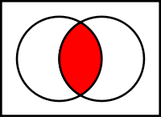

# Logic

Logic is, broadly speaking, the application of reasoning to an activity or concept.  In Computer Science, we primarily use deductive reasoning (a.k.a. deductive logic) along with boolean algebra (e.g. two-valued logic).

# Traditional Logic Symbols

Traditional logic and logical proofs, of the sort you probably learned along with Geometry in grade-school, has a formal set of symbols associated with it.

These may seem familiar:

* Implication: ⇒
* Equivalence: ⇔
* Negation (not): ¬  ~  ≠
* Conjunction (and): & ^
* Disjunction (or): ∨
* Precedence Grouping: ()

On the other hand, they may not seem familiar.  Doesn't matter! We're not going to use those symbols; I've only included them for your reference, as most treatise on the subject do use the formal symbols.

Henceforth, whenever discussing logic, I'll be using the more traditional programming symbols for logic:

* Equivalence: ==
* Negation: ! or !=
* Conjunction: &&
* Disjunction: ǀǀ
* Precedence Grouping: ()

## Basic Operations

Note: iff mean "if and only if"

### And / Conjunction

A && B is true iff A is true and B is true.

A truth table illustrating this:

	| A | B | A && B |
	| 0 | 0 | 0      |
	| 0 | 1 | 0      |
	| 1 | 0 | 0      |
	| 1 | 1 | 1      |

A venn diagram illustrating this:

### Or / Disjunction

A || B is true if A is true or B is true.

A truth table illustrating this:

	| A | B | A || B |
	| 0 | 0 | 0      |
	| 0 | 1 | 1      |
	| 1 | 0 | 1      |
	| 1 | 1 | 1      |

A venn diagram illustrating this:

### Not / Negation

!A is true if A is false

A truth table illustrating this:

	| A | !A |
	| 0 | 1  |
	| 1 | 0  |

A venn diagram illustrating this:

### Equality

A == B is true if A and B both have the same value.

A truth table illustrating this:

	| A | B | A == B |
	| 0 | 0 | 1      |
	| 0 | 1 | 0      |
	| 1 | 0 | 0      |
	| 1 | 1 | 1      |

### Precedence Grouping

() is used to override the standard order of operations.

For example:

A && B || C  is not equivalent to A && (B || C)

	| A | B | C | A && B || C | A && (B ||r C) |
	| 0 | 0 | 1 | 1           | 0              |
	| 0 | 1 | 0 | 0           | 0              |
	| 0 | 1 | 1 | 1           | 0              |
	| 1 | 0 | 0 | 0           | 0              |
	| 1 | 0 | 1 | 1           | 1              |
	| 1 | 1 | 0 | 1           | 1              |
	| 1 | 1 | 1 | 1           | 1              |

## Laws of Boolean Algebra

Again, these may mostly be vaguely remembered from Geometry and Algebra classes.

If they don't seem intuitive to you, try writing them out in truth table form (the tables above are examples of truth tables)!

### Associativity

	A || (B || C) == (A || B) || C

	A && (B && C) == (A && B) && C

### Commutativity

	A || B == B || A

	A && B == B && A

### Distributivitiy of AND over OR

	A && (B || C) == (A && B) || (B && C)

### Identity

	A || 0 == A

	A && 1 == A

### Annihalator for AND

	X && 0 == 0

## Annihilator for OR

	X || 1 == 1

### Idempotence

	A && A == A

	A || A == A

### Absorption

	A && (A || B) == A

	A || (A && B) == A

## Deductive Reasoning

Deductive reasoning also applies to boolean algebra.  Start by reading the wikipedia article on it (See below), and then put in a pull request on this repo with your notes!

## Further Reading:

* [Wikipedia: Logic](http://en.wikipedia.org/wiki/Logic)
* [Wikipedia: Boolean Algebra](http://en.wikipedia.org/wiki/Boolean_algebra)
* [Wikipedia: Deductive Reasoning](http://en.wikipedia.org/wiki/Deductive_reasoning)
* The Article on Venn Diagrams

## Sources:

* [Wikipedia: List of logic symbols](http://en.wikipedia.org/wiki/List_of_logic_symbols)
* [Wikipedia: Boolean Algebra](http://en.wikipedia.org/wiki/Boolean_algebra)
